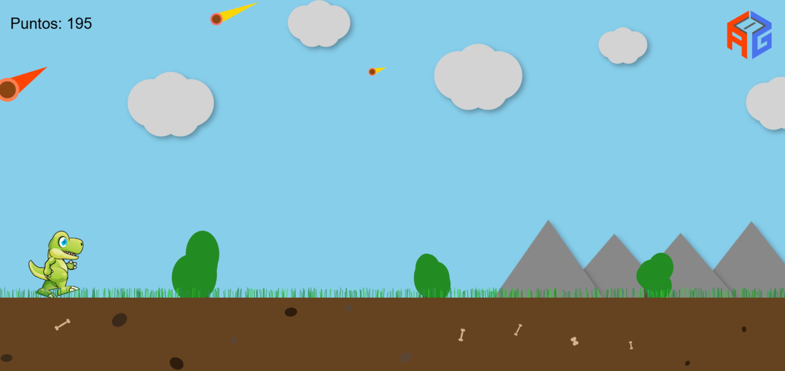

# 🦖 AG - DinoRun

See [README.es.md](README.es.md) for the Spanish version.

A JavaScript *runner* style game inspired by the classic Chrome dinosaur, featuring obstacles, meteor animations, layered mountains, depth clouds, improved collision detection, and enhanced visual design.

## 🎮 How to Play

- Press **space** or **tap the screen** to start the game.
- The dinosaur runs automatically.
- **Jump** with the **space** key or by tapping the screen to avoid obstacles.
- Dodge obstacles to survive.
- The game ends if you collide with something.

## 🚀 Features

- Dynamically generated random obstacles.
- Meteors with realistic trajectories and diagonal fall.
- Hills/mountains with parallax for depth sensation.
- Animated 3D clouds and smooth gradients.
- Jump, collision, and background sounds.
- Progressive score increment system.
- Precise collision detection with adjustable margin.
- Touch and keyboard controls.

## 🎮 Play Now

https://agsoft.co.cr/juegos/dino/juego.html

_Created by **A&G Programación y Desarrollo de Sistemas Informáticos S.A.**_